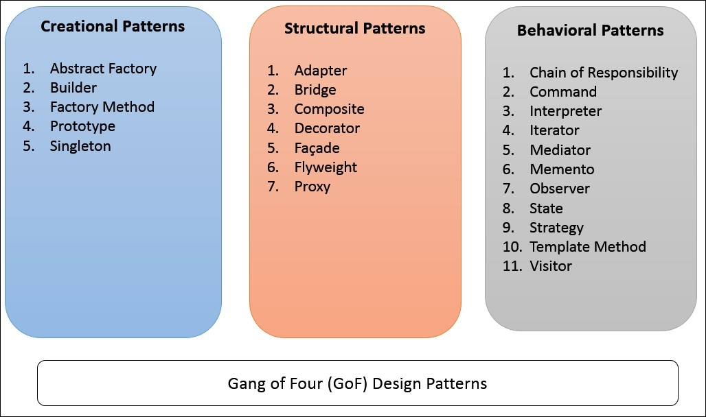

# Apex-Design-Patterns

## **The SOLID Principle **

SOLID is short for basic five principles of OOP, which was introduced in the early 2000s and adopted widely in the software industry. When these principles are combined together, a programmer can create an application that will be easy to maintain and can be extended over time. 

The SOLID abbreviation is defined as follows: 
**S:** Single responsibility principle 
**O:** Open closed principle 
**L:** Liskov substitution principle 
**I:** Interface segregation principle 
**D:** Dependency inversion principle

##### **1. The single responsibility principle (SRP):**
This states that a class should have only one reason to change it, and this means, it should have a single job. 

**2. The open closed principle (OCP):**
This states that entities of software, such as classes and methods, should be open for extension but closed for modification. This means that classes and methods should be allowed to be extended without modification.

##### **3. Liskov substitution principle (LSP): **
This states that if class B is a child of class A, then A can be replaced by B, without changing anything in a program. In other words, the LSP principle states that you should not encounter unexpected results if child (derived) classes are used instead of parent classes.

##### **4. The interface segregation principle (ISP): **

This states that do not force a child class to depend on a method that is not used for them. This principle suggests that you break interfaces into smaller ones so that a client can only implement an interface that is of interest. 

##### **5. The dependency inversion principle (DIP):**
This states that modules should not depend on each other directly and should depend via an interface (abstraction). 

In other words, two classes should not be tightly coupled. Tightly coupled classes cannot work independently of each other, and if a change is required, then it creates a wave of changes throughout the application.

------------